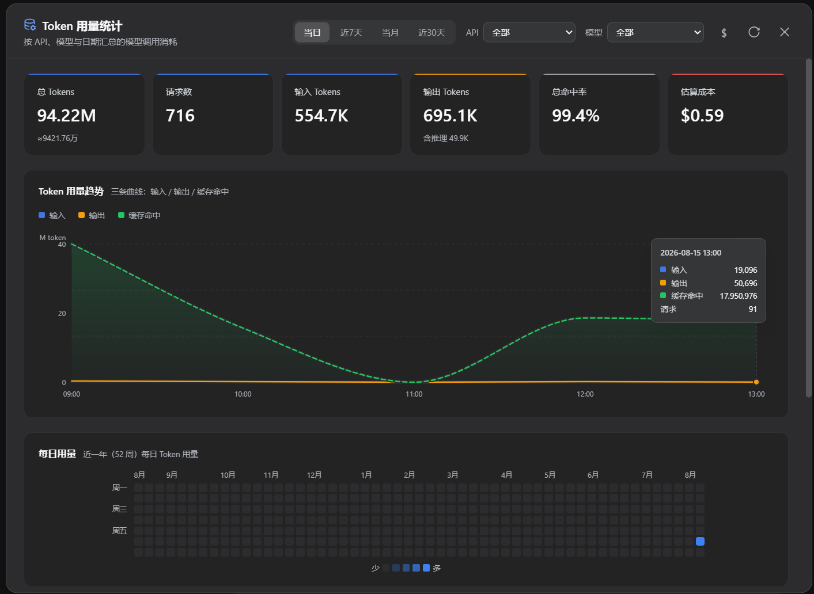
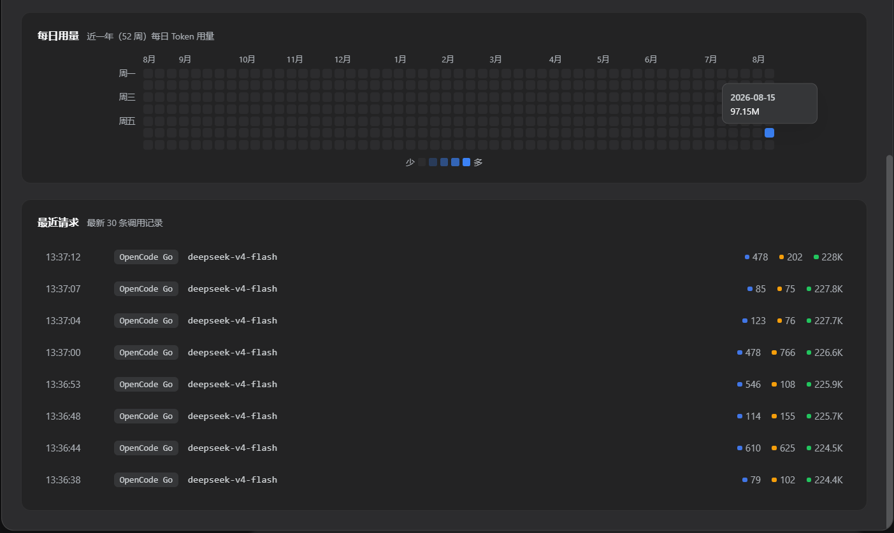
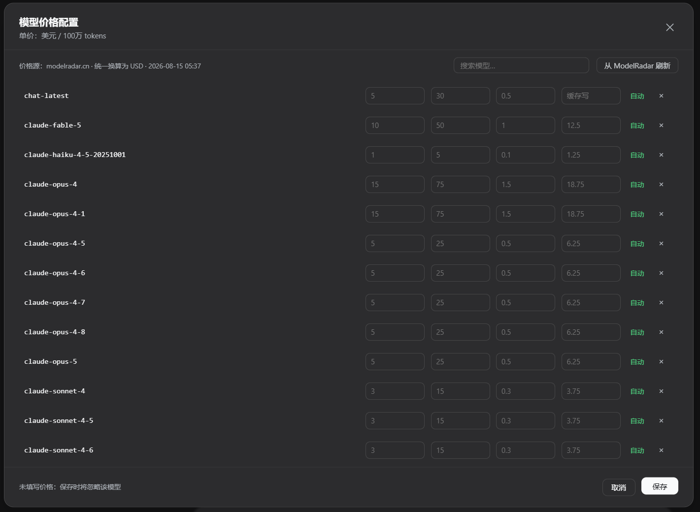

# @zerro223/dsh-token-usage — DSH Token 用量统计插件

[](https://www.npmjs.com/package/@zerro223/dsh-token-usage)
[](LICENSE)
[](https://github.com/zerro-223/dsh-token-usage)

在 DeepSeek Harness Web UI 的侧边栏底部（设置按钮旁）增加「Token 用量」入口，
打开一个统计面板，按 **API（provider）**、**模型** 和 **日期** 分类展示模型调用的
Token 消耗，并配有流畅的入场/更新动画（数字滚动、柱状图生长、环形图描边、
逐项 stagger），自动适配深色/浅色主题（复用 DSH 的 `--dsw-*` 设计令牌）。

> npm 上的 `dsh-token-stats` 名称已被其他作者占用，本包名为 `@zerro223/dsh-token-usage`。

## 界面预览







## 工作原理

- **Node 端**（`lib/index.js`）：监听 `llm/stream` waterfall 事件，捕获每次
  模型调用的 `usage` chunk（输入 / 输出 / 缓存读 / 缓存写 / 推理 tokens），
  逐条追加持久化到 `~/.dsh/storages/token-stats/usage.jsonl`，并通过
  `/token-stats/api/overview?days=hour|7|month|30&provider=xxx&model=xxx`
  提供聚合结果（时间序列 `series`、统计 `totals`、缓存命中率
  `cacheHitRate`、筛选下拉选项 `filterOptions`）。
- **浏览器端**（`lib/client.js`）：注册 `sidebar.footer.action` 槽位
  （id `token-usage`），点击后打开统计面板：
  - 6 张统计卡：总 Tokens、请求数、输入、输出（含推理提示）、总命中率、估算成本（USD）
    （DeepSeek 等多数 provider 不报告 cache 读写明细，故不单列缓存卡片）
  - 成本估算：按模型单价（$ / 100万 tokens，输入 / 输出 / 缓存读 / 缓存写）× 实际用量计算；
    价格自动同步自 [modelradar.cn](https://modelradar.cn)（启动时拉取 + 每日刷新，
    缓存于 `prices-auto.json`）。注意单位：modelradar 数据集按模型原生币种计价
    （294 个模型里 183 个为 CNY），插件统一取数据集的 `*PriceUsdPer1M` 换算字段
    存成 USD，CNY 来源的模型在面板中标注「自动·源CNY」；「$」按钮可查看自动匹配结果、
    按名称搜索模型、手动覆盖或强制刷新；手动价格优先于自动价格，未定价模型会在成本卡上提示
  - 大趋势图：按「输入(深蓝) / 输出(琥珀) / 缓存命中(绿)」三色平滑曲线（单调插值，
    无过冲越界）+ 渐变面积，三条曲线共用统一 y 轴，带刻度与单位（M/K token）；
    支持区间切换（当日近5小时按小时粒度、近7天、当月、近30天按天粒度），x 轴按整段
    横轴均分，悬停显示十字线与明细；切换 API / 模型 / 日期范围时会重新播放曲线动画
  - 每日用量热力图（GitHub Contribution 风格）：近一年（52 周）按天展示 Token 用量，
    左侧带周几标识，蓝色越深表示当天用量越高，悬停可查看具体日期与用量；
    跟随当前 API / 模型筛选
  - 模型 / API 筛选：只查看指定模型或提供方的数据（统计卡与图表同步过滤）
  - 最近请求：最新 30 条调用记录（时间 / API / 模型 / tokens）
  - 每 15 秒自动刷新，也可手动刷新

## 安装

### 方式一：npm 安装（推荐）

```sh
dsh plugin --profile web add @zerro223/dsh-token-usage
```

包声明了 `dsh.bundle.patch`，`dsh plugin` 会在 pnpm 安装后自动把它加入
profile 的 layer 栈（无需手动改 `cordis.patch.yml`）。重启 DSH Web 生效。
其他 profile（tui / headless）把 `web` 换成对应名字即可，数据共享同一份存储。

### 方式二：本地源码安装

1. 将 `@zerro223/dsh-token-usage` 目录复制到 profile 的 `node_modules`：
   ```
   C:\Users\<you>\.dsh\profiles\web\node_modules\@zerro223/dsh-token-usage\
   ```
2. 在 `C:\Users\<you>\.dsh\profiles\web\cordis.patch.yml` 中追加：
   ```yaml
   - insert:
       - id: token-usage
         name: '@zerro223/dsh-token-usage'
   ```
3. 重启 DSH Web（`dsh web`），打开 `http://127.0.0.1:3080`。

### 方式三：本地目录 / Git 仓库安装

```sh
# 本地目录（file: 协议，绝对路径或相对路径均可）
dsh plugin --profile web add file:D:/path/to/dsh-token-usage

# GitHub 仓库（需要 allowBuilds 时按 pnpm 提示配置）
dsh plugin --profile web add github:zerro-223/dsh-token-usage
```

## 数据

- 存储位置：`~/.dsh/storages/token-stats/usage.jsonl`（每请求一行 JSON）。
- 内存上限：最近 50 万条记录（超出时丢弃最旧）。
- 重试 / 重复请求：每次真实到达 provider 的调用都会记录（`llm/stream`
  瀑布每次调用触发一次；llm-retry 的重试经由 agent loop 的
  `agent/request-error` 重新发起请求，因此每次尝试都会计入）。
- 卸载插件不会删除历史数据；重新启用即恢复统计。

## 开发

- `lib/index.js`：node half（无第三方运行时依赖，仅 `@deepseek-ai/dsh-home-paths`）。
- `lib/client.js`：browser half（`__ModuleLoader__.load` 格式，依赖
  react / `@deepseek-ai/dsh-client-ui-primitives`，无第三方图表库，
  图表全部为手写 SVG / CSS 动画）。
